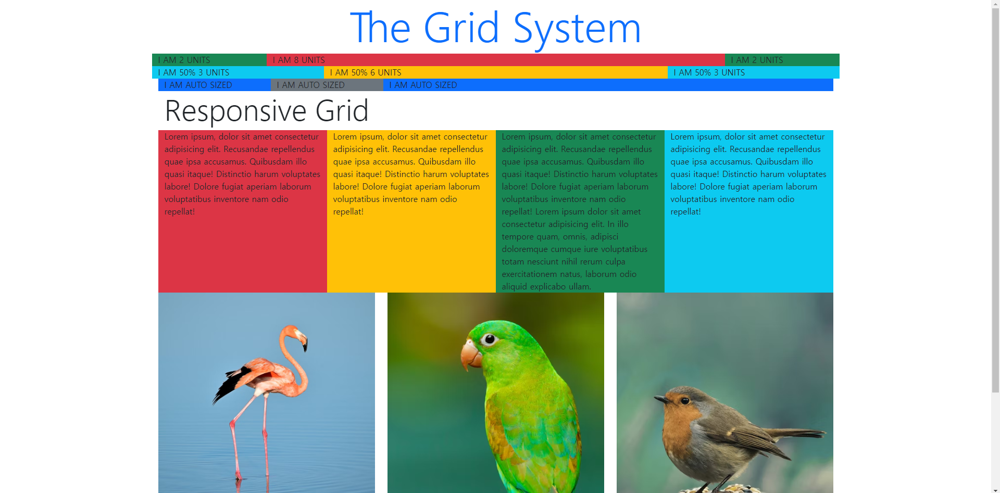
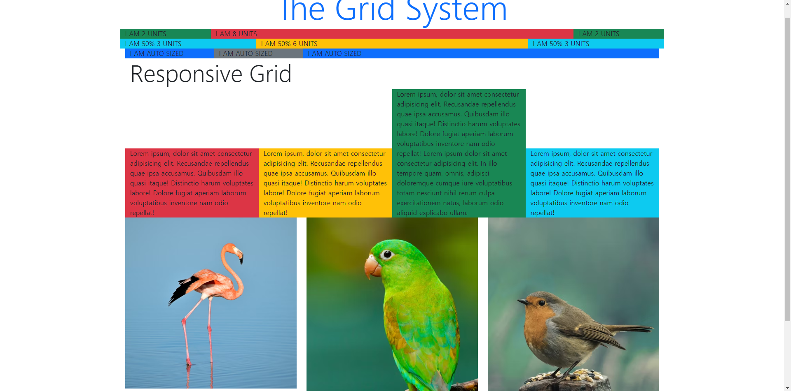
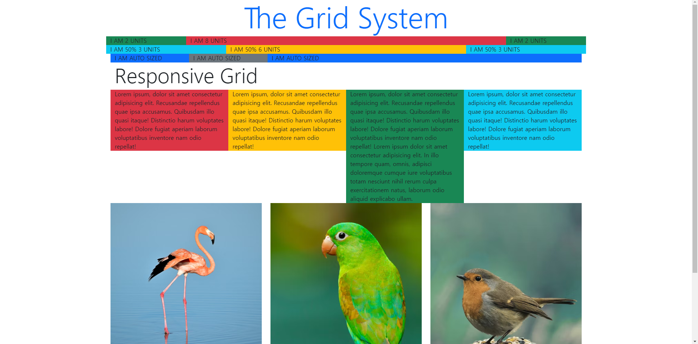
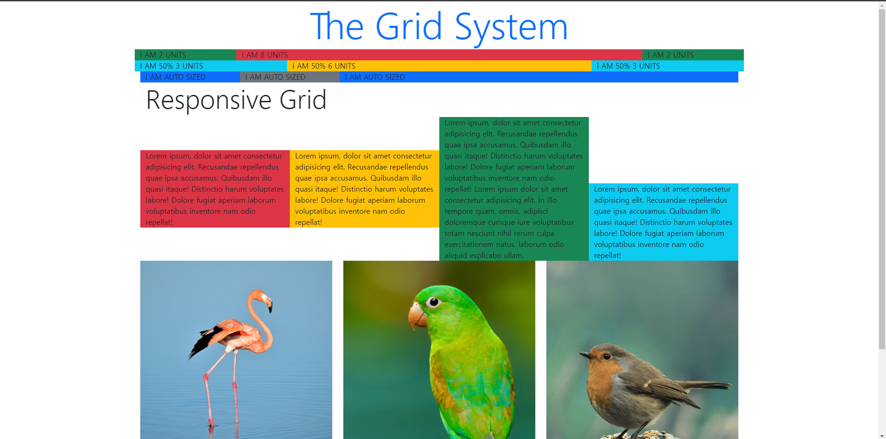
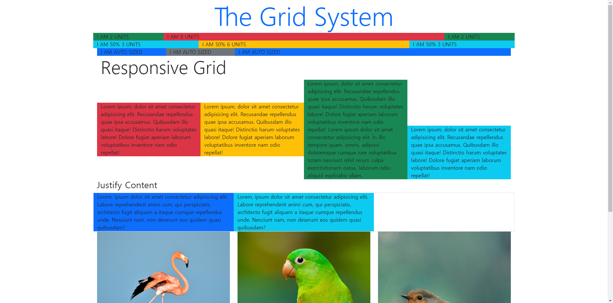
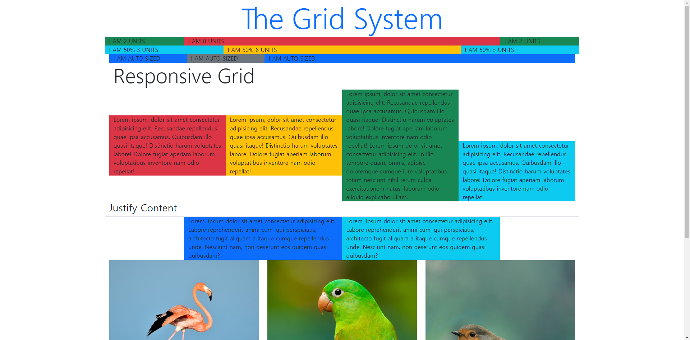
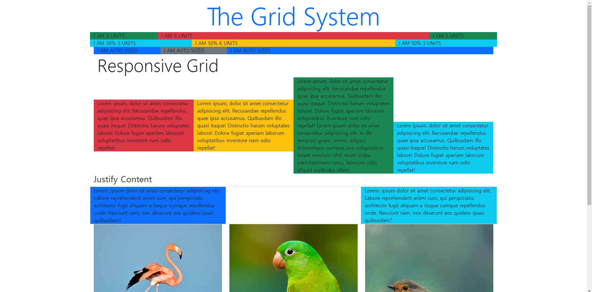
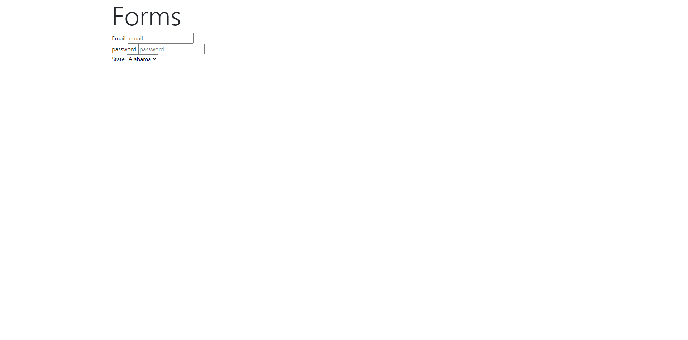
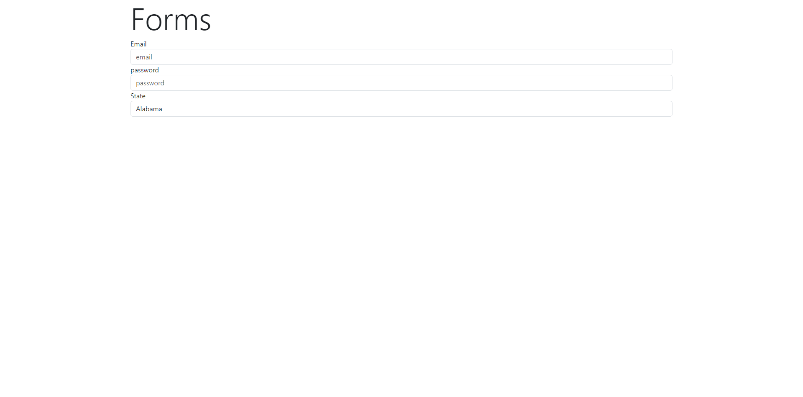
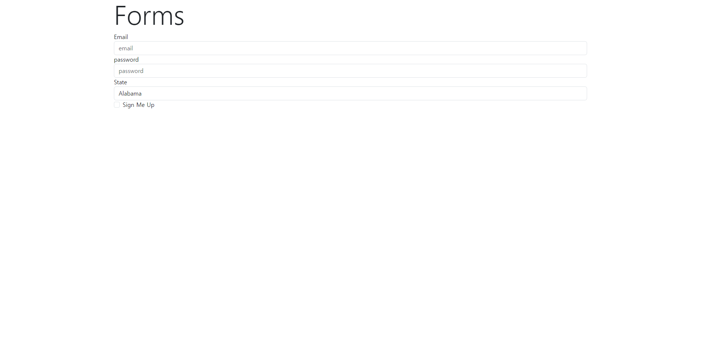

# 131. 유용한 그리드 유틸리티

### 콘텐츠를 <u>수직</u> 정렬할 때 적용할 수 있는 옵션들
- align-items-start
- align-items-center
- align-items-end
- align-self-start
- align-self-center
- align-self-end

```html
<div class="row align-items-start"></div>
<div class="row align-items-center"></div>
<div class="row align-items-end"></div>
```
* **효과를 주기 전 원본**  


* **class="row align-items-end"를 주었을 때 예)**  
  
콘텐츠가 아래를 기준으로 정렬됨

* **반대로 class="row align-items-start"를 주었을 때 예)**  


<br>요소 한개에만 적용할 수도 있다
```html
<div class="column align-self-start"></div>
<div class="column align-self-center"></div>
<div class="column align-self-end"></div>
```
단 여기서는 items가 아닌 self로 변경되었다.

* **전체 요소는 class="row align-item-center"이면서 마지막만 class="column align-self-end" 효과를 주었을 때**  


### <br>콘텐츠를 <u>수평</u> 정렬할 때 적용할 수 있는 옵션들
- justify-content-start
- justify-content-center
- justify-content-end
- justify-content-between

```html
<div class="row justify-content-start"></div>
<div class="row justify-content-center"></div>
<div class="row justify-content-end"></div>
<div class="row justify-content-between"></div>
```
* **효과를 주기 전 원본**  


* **class="row justify-content-center"를 주었을 때 예)**  
  
콘텐츠가 중앙 기준으로 정렬됨

* **class="row justify-content-between"를 주었을 때 예)**  
  
콘텐츠가 양 끝으로 정렬

justify-content-lg-start, justify-content-xl-between 등으로 변경점을 줄 수 있다.

# 132. 부스트랩과 폼(Forms)
참고: https://getbootstrap.com/docs/5.3/forms/overview/

### 기본적인 폼 형식
- form-group
```html
<div class=form-group></div>
```
### 폼컨트롤
- form-control
```html
<form action="#nowhere">
    <div class="form-group">
        <label for="email">Email</label>
        <input type="email" class="form-control" id="email" placeholder="email">
    </div>
    <div class="form-group">
        <label for="password">password</label>
        <input type="password" class="form-control" id="password" placeholder="password">
    </div>
    <div class="form-group">
        <label for="state">State</label>
        <select class="form-control" name="state" id="state">
            <option value="AL">Alabama</option>
            <option value="AK">Alaska</option>
        </select>
    </div>
</form>
```
**폼컨트롤을 적용하지 않았을 때**  


**폼컨트롤을 적용했을 때**  


**form-control-lg**, **form-control-sm** 등으로 크기를 조정할 수 있다. 

* **form-check**<br>
[bootstrap-check&radios](https://getbootstrap.com/docs/5.3/forms/checks-radios/#default-stacked)<br>
해당 체크박스의 아이콘은 더 둥근 모서리를 가졌으며 클릭했을 때 반짝이는 효과가 있다. 
```html
<div class="form-check">
                <input class="form-check-input" type="checkbox" value="" id="defaultCheck1">
                <label class="form-check-label" for="defaultCheck1">
                    Sign Me Up
                </label>
            </div>
```
input 태그에는 **form-check-input**
label 태그에는 **form-check-label**

위 코드 결과  


* **폼에 레이아웃 주는 법**<br>
1. 그냥 row를 주는 방법
```html
 <form action="#nowhere">
            <div class="row">
                <div class="form-group col">
                    <label for="email">Email</label>
                    <input type="email" class="form-control" id="email" placeholder="email">
                </div>
                <div class="form-group col">
                    <label for="password">password</label>
                    <input type="password" class="form-control" id="password" placeholder="password">
                </div>
            </div>
```
위 코드 결과  
<br>
~~2. form-row를 주는 방법~~&nbsp;&nbsp;작동 안함.  
~~1번과의 차이는 폼 사이의 공간이 줄어듦~~
```html
<form action="#nowhere">
            <div class="form-row"> <!--form-row 작동 안함.-->
                <div class="form-group col">
                    <label for="email">Email</label>
                    <input type="email" class="form-control" id="email" placeholder="email">
                </div>
```