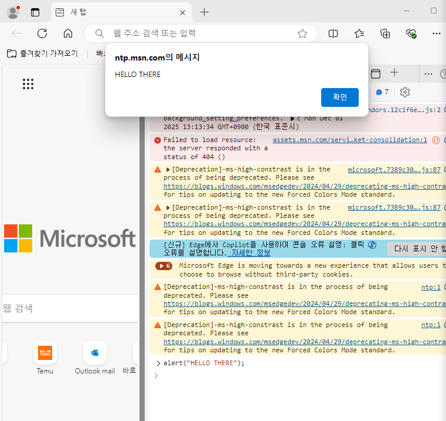
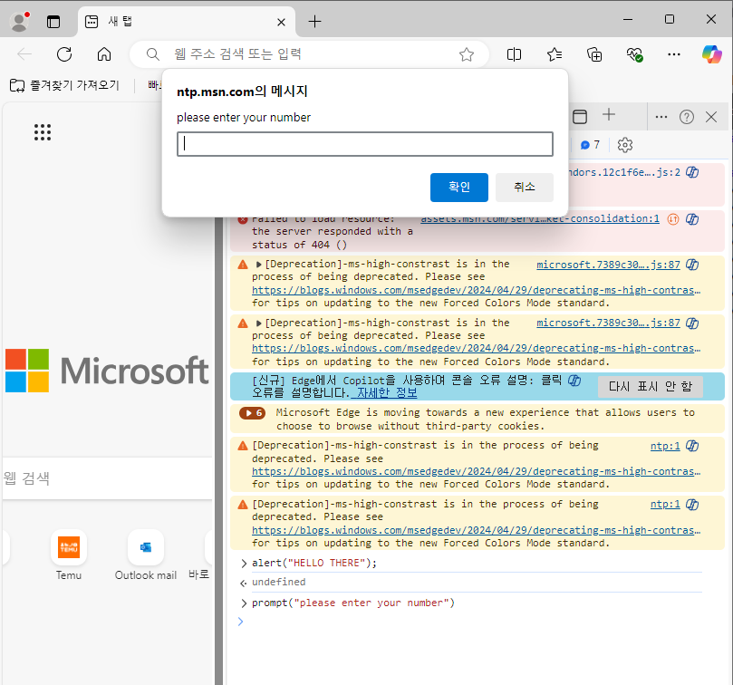

# JavaScript 판단 내리기

### comparisons
\> : greater than<br>
\< : less than<br>
\>= : greater than or equal to<br>
\<= : less than or equal to<br>
\== : equality<br>
\!= : not equal<br>
\=== : strict equality<br>
\!== : strict non-equality<br>

**==과 ===의 특징**
==는 타입을 같게 만들고 비교 / ===는 객체 타입도 같아야 함.
```JavaScript
1 == '1'; // true
0 == ''; // true
0 == false; //true
null == undefined; //true

2 === '2' // false
null === undefined // fasle
0 === false // false
```

### Console, Alert, Prompt
**console.log() : 브라우저에서의 출력 (다른 언어의 print문과 비슷)**
**alert() : 브라우저에서의 알림창 생성**
예)
```JavaScript
alert("HELLO THERE!");
```
<br>
**prompt() : 브라우저에서의 입력창 생성**
예)
```JavaScript
let userInput = promt("please enter a number"); // 사용자가 무엇을 입력하든 무조건 문자열로 입력받음
```
<br>

### parseInt()
string을 정수로 변경해주는 메소드
```JavaScript
parseInt("101");
>>> 101
```

### JavaScript 파일
자바스크립트 파일은 확장자가 .js이다. 자바스크립트를 html과 연결해주기 위해서는 script 태그가 필요하다.<br>
주로 script 태그는 body 태그의 끝에 작성한다.
```html
<body>
    .
    .
    .
    <script src="주소"></script>
</body>
```

### if 문
if 사용 예시
```JavaScript
let rating = 3;
if (rating === 3) {
    console.log("YOU ARE A SUPERSTAR!!");
}
else if (rating === 2) {
    console.log("MEETS EXPECTATIONS");
}
else if (rating === 1) {
    console.log("NEEDS IMPROVEMENT");
}
```